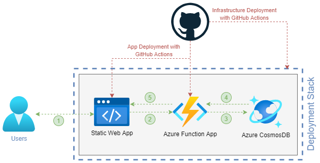

# My life in a PowerShell

## About
I wanted to create a personal website, but a classic design was too boring to keep me excited enough to build it. When I saw a portfolio site designed like bash, I knew this was the type of site I want and started working on this project.

Since I work every day with PowerShell, I decided to replicate its design and syntax.

## Commands and features

The commands return information about me. 

| Command | Description |
|---------|-------------|
|Get-Help | Returns all available commands and information about them |
|Get-Hobby| Returns a list of my hobbies |
|Get-Certification| Returns a list of all my acitive certifications|
|Get-Skill| Returns a list of my skills and how proficient I am in each of them|
| Get-Education| Returns information about my formal education|
| Get-WorkExperience| Returns a list of my last jobs|
| Get-PersonalInformation | Returns personal information about me |
| Open-GitHubRepo | Opens the projects repository |
| Open-SoundCloud | Opens my SoundCloud page |
| Open-LinkedIn | Opens my LinkedIn profile |
| Show-Welcome | Opens the welcome message, that is opened when the page loads the first time |
| Clear-Host | Removes all text inside the shell. The command history will not be deleted. Alias: 'clear'. |

I also tried to make the experience as close to working in an actual PowerShell as possible. That's why I implemented the following features:

- Complete a command using the <code>"Tab"-Key</code>.
- Interrupt the current input with <code>ctrl+c</code>.
- Navigate through the command history by using the <code>arrow keys up and down</code>.

## Infrastructure

In my job I design and deploy Azure Infrastructure using IaC (Bicep and Terraform). So I decided to host the app in Azure and deploy it as code over GitHub Actions.

### Overview

  

<!-- 
 -->

1. User interacts with site.
2. Command gets send to Function App.
3. Function App authenticates against CosmosDB with managed identity and gets the .json, in which the command is defined.
4. CosmosDB returns the json content.
5. Function App responds with a json object and Frontend renders the command output for the user.

### Frontend
For the frontend I used a Static Web App, as it has a free sku, which has almost no limitations that were relevant to my plan (except only allowing managed functions and no managed identity).

### API
As I didn't want all my information and especially no secrets in the frontend code, I decided to create an API that connects to a database, in which the command responses are defined. To authenticate against the database, I use the managed identity of the function app.

When I started my bachelor (early 2024), the first course used Go. I liked the language a lot (I tried Python and Javascript before) and decided to build the API in it (which made the automatic deployment to Azure Functions a bit of a pain though...).

### Database
Since I wanted the API to respond with the commands in json format, I decided to use a NoSQL database. Though it is quite overkill for the project, I used Azure CosmosDB, since it has a free sku and I wanted to try it. Azure Storage for Tables would have been enough too though.

## Pipelines/GitHub Actions

Deploying the Infrastructure and Static Web App was pretty staight forward. From my job I am more used to Azure DevOps Pipelines, but lots of the knowlege also applies to GitHub Actions.

When trying to automate the deployment of the Go-API to Azure Functions, I found out that it is not possible with the "functions-action". The solution I came up with was to use a self-hosted runner and install the Azure Function Core Tools. After that, the deployment worked very well using the command <code>func azure functionapp publish "function-app-name" --custom</code>.

